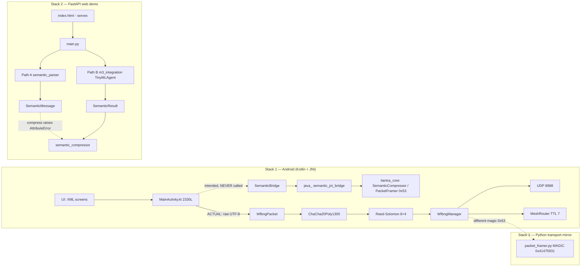
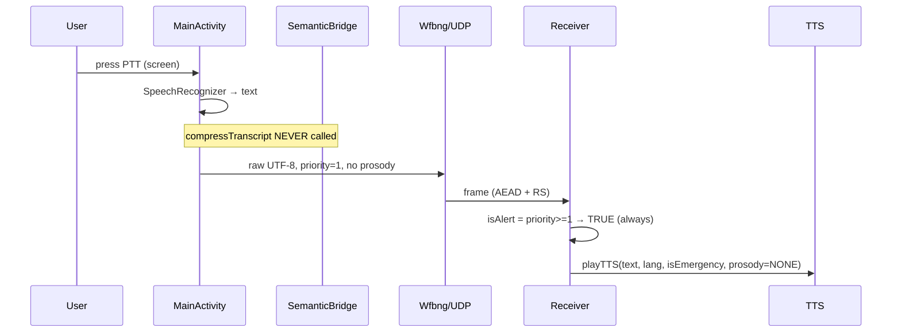
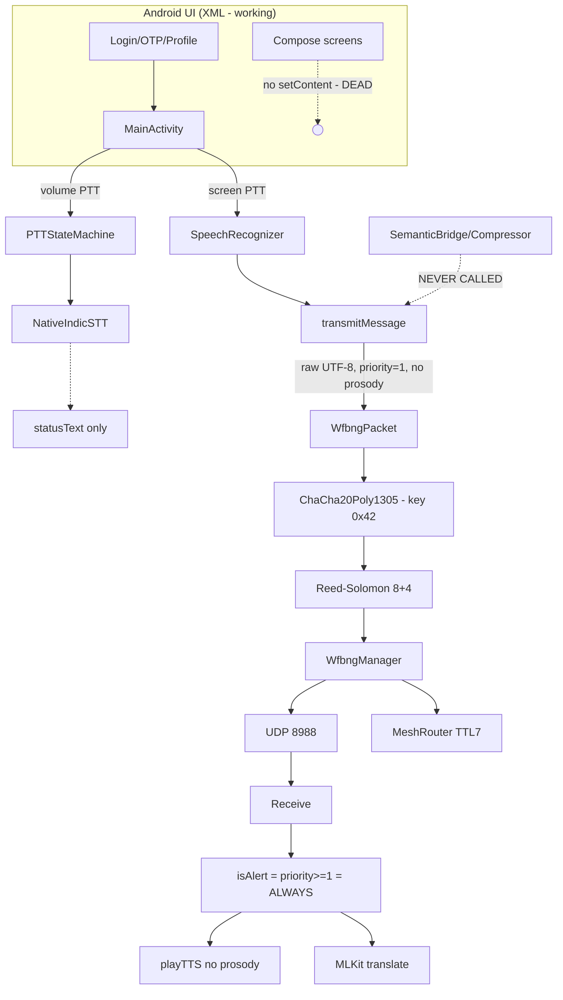
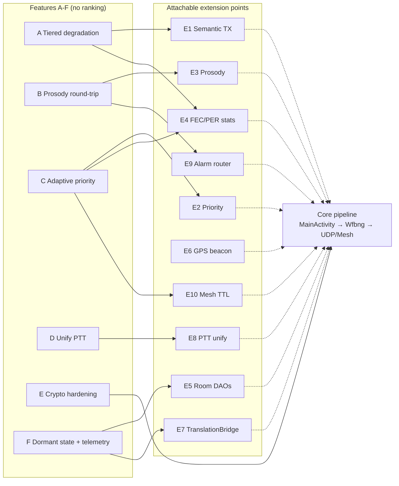

# iTantra — XAI Technical Audit (Explainable Codebase Analysis)

> **Project:** iTantra — Offline multilingual mesh walkie-talkie for disaster zones
> (SIH 2026 | ISRO | SIH26173) — VOICE → MEANING → COMPACT PACKET → MEANING → VOICE
>
> **Scope:** This document analyzes the *actual source code* in this repository, not the
> documentation's claims. Where a claim could not be confirmed from code, it is labeled
> **"Unable to verify from current codebase"**.
>
> **Measurement labels:**
> - **Measured** — obtained by executing code/tests in this repository.
> - **Estimated** — derived from static inspection (file sizes, code paths, constants).
> - **Not Available** — no measurement exists; no number is invented.
>
> **Ranking policy:** Extension areas and feature options are presented **without any
> best/worst ordering**. A feasibility matrix reports *facts* (effort, risk, readiness),
> not a recommendation of a single feature.

---

## Table of Contents
1. [Project Structure](#1-project-structure)
2. [Architecture Overview](#2-architecture-overview)
3. [Data Flow: Transmission Pipeline](#3-data-flow--transmission-pipeline)
4. [Security Model (Current State)](#4-security-model--current-state)
5. [TTS System (Current State)](#5-tts-system--current-state)
6. [Edge Capability (On-Device ML)](#6-edge-capability--on-device-ml)
7. [Storage Layer](#7-storage-layer)
8. [UI Layer](#8-ui-layer)
9. [Feature Inventory](#9-feature-inventory)
10. [Performance Observations](#10-performance-observations)
11. [Failure Points & Weaknesses](#11-failure-points--weaknesses)
12. [Dependency Map](#12-dependency-map)
13. [Extension Points](#13-extension-points)
14. [Possible Features A–F](#14-possible-features-a-f)
15. [Feasibility Matrix](#15-feasibility-matrix)
16. [Safe-Modification Guidelines](#16-safe-modification-guidelines)
17. [10–20 Extension Areas](#17-1020-extension-areas)
18. [Mermaid Diagrams](#18-mermaid-diagrams)
19. [Documentation-vs-Reality Check](#19-documentation-vs-reality-check)
20. [Final Summary](#20-final-summary)

---

## 1. Project Structure

```
SIH2026/
├── android/                          # Android app (Kotlin + C++ JNI)
│   └── app/src/main/
│       ├── java/org/isro/itantra/
│       │   ├── MainActivity.kt               # 2,330 lines — TX/RX hub
│       │   ├── semantic/SemanticBridge.kt    # JNI → libitantra_core.so (unused by TX)
│       │   ├── transport/
│       │   │   ├── wfbng/{WfbngManager,ChaCha20Poly1305Engine,ReedSolomonFECEngine}.kt
│       │   │   ├── mesh/MeshRouter.kt        # TTL=7, rebroadcast, dedup LRU 2000
│       │   │   ├── udp/UdpTransceiver.kt     # port 8988
│       │   │   ├── WfbngPacket.kt
│       │   │   └── WifiP2pTransport.kt       # never instantiated (dead)
│       │   ├── database/                     # Room v3, 3 entities
│       │   │   ├── MessageDatabase.kt
│       │   │   ├── dao/{MessageDao,MeshPeerRegistryDao,EmergencyCodebookDao}.kt
│       │   │   └── DatabaseTransitionLogger.kt   # only DAO actually written
│       │   ├── runtime/
│       │   │   ├── MessageScheduler.kt       # 8s fallback
│       │   │   ├── PTTStateMachine.kt        # volume-key path
│       │   │   └── ...
│       │   ├── input/PttInputController.kt
│       │   ├── audio/PttAudioAdapter.kt
│       │   ├── RadioDaemonService.kt         # notification-only stub
│       │   ├── TacticalCompass.kt            # unused
│       │   └── EmergencyCodebook.kt          # never populated
│       ├── cpp/
│       │   ├── CMakeLists.txt                # targets: audio_stt_core, audio_tts_core, itantra_core
│       │   ├── IndicSTTEngine.cpp            # ONNX IndicConformer (dead in main flow)
│       │   ├── SileroVAD.cpp                 # 80-mel, 10s silence timeout
│       │   ├── IndicTTSEngine.cpp            # formant synthesis (NOT neural)
│       │   ├── NativeTTSBridge.cpp
│       │   ├── MelSpectrogram.hpp
│       │   ├── fec/ReedSolomonFECEngine.cpp  # RS GF(2^8) Cauchy K=8 M=4
│       │   ├── crypto/ChaCha20Poly1305Engine.cpp
│       │   └── semantic/
│       │       ├── PacketFramer.cpp/.hpp     # COMPACT_MAGIC 0x53, MAX 38B, frag 27B
│       │       ├── SemanticCompressor.cpp    # 6B/18B/≤36B tiers
│       │       ├── TinyMLAgent.cpp           # 625 lines, rule-based (no Ort::Session)
│       │       ├── TranslationBridge.cpp     # 10-lang template (unwired)
│       │       ├── Member3Integration.cpp
│       │       └── semantic_jni_bridge.cpp
│       ├── assets/                           # encoder.onnx 2.98MB, ctc_decoder 23MB, silero 2.3MB
│       └── AndroidManifest.xml               # usesCleartextTraffic="true"
│
├── transport/                        # Python mirror of the transport stack
│   ├── packet_framer.py              # protobuf MAGIC 0x41475931 (≠ Android 0x53)
│   ├── crypto_engine.py
│   └── tests/                        # FAIL on import: No module named 'crypto_engine'
│
├── proto/packet_schema.proto          # VoicePacket, PriorityLevel; prosody_vector reserved
├── web-demo/
│   ├── backend/                      # FastAPI (main.py, semantic_*, m3_integration, auth)
│   │   └── tests/                    # 205 passed (in .venv)
│   └── frontend/
│       ├── index.html                # 1,030 lines vanilla — this is what serves
│       └── src/                      # React, 2,231 lines — cannot mount (no #root)
│
├── CMakeLists.txt                    # protobuf v3.21.12 static, arm64-v8a
└── *.md                              # README.md (corrupted/nested), DEVELOPMENT_README.md,
                                      # SIH2026_STATUS.md, web-demo/backend/README_MEMBER3.md
```

**Lines of code (Estimated, from file inspection):**

| Component | Language | LOC |
|---|---|---|
| Android app | Kotlin | ~7,454 |
| Android natives | C++ | ~4,958 |
| Web/transport backend | Python | ~6,030 |
| Frontend (vanilla + React) | HTML/JS | index.html 1,030 + src 2,231 |

**Build facts:** minSdk 24 / targetSdk 35, **arm64-v8a only**, NDK 30, CMake 3.21.12/3.22.1,
C++20, `libprotobuf-lite` (`optimize_for = LITE_RUNTIME`). Debug APK = **79 MB (Measured)**.

---

## 2. Architecture Overview

Two independent stacks plus a Python transport mirror:

**Stack 1 — Android (the real product):**
Kotlin UI → `MainActivity` → either
  - *(intended)* `SemanticBridge` → JNI `itantra_core` → semantic tiers → `WfbngPacket`
    → crypto → FEC → `WfbngManager` → UDP/Mesh → wire
  - *(actual)* raw UTF-8 → `WfbngPacket` → crypto → FEC → `WfbngManager` → UDP/Mesh → wire

**Stack 2 — Web demo:** FastAPI backend with **two parallel semantic paths** (Path A:
`semantic_parser` → `SemanticMessage`; Path B: `m3_integration` → `TinyMLAgent` →
`SemanticResult`) and a frontend that serves the vanilla `index.html`, not the React `src/`.

**Stack 3 — `transport/`:** a Python re-implementation of the framing/crypto/FEC used for
standalone tests; it speaks a **different wire format** (protobuf magic) than Android's C++
framer (compact magic `0x53`).



---

## 3. Data Flow — Transmission Pipeline

### 3.1 What the code actually does on Android TX

Entry point: `MainActivity.transmitMessage` (~line 1267).

1. Text is encoded **raw UTF-8** — `SemanticBridge.compressTranscript` is **never called**
   anywhere in the TX path. *(Verified: no call site.)*
2. Packet is built with **`priority` hardcoded to `1`** (line 1275).
3. `extractProsodyBytes()` (pitch + RMS, 16 bytes, ~line 1647) is computed in the audio
   path but **never attached** to the outgoing packet.
4. Packet → `ChaCha20Poly1305Engine` → `ReedSolomonFECEngine` (K=8, M=4) → `WfbngManager`
   → UDP unicast/multicast or `MeshRouter` rebroadcast (TTL 7, dedup LRU 2000).

### 3.2 Receive path

1. UDP/Mesh inbound → FEC decode → AEAD decrypt → payload decoded **as UTF-8 directly**
   (no semantic decode step).
2. `isAlert = priority.toInt() >= 1 || …` — because every TX sets `priority = 1`,
   **every message is classified as an alert/SOS and jumps the queue.**
3. Playback via `playTTS(text, lang, isEmergency, prosodyBytes)` — called at lines 769,
   1546, 1564 **without prosody bytes**; translation via MLKit (English pivot).

### 3.3 Push-to-Talk — two disconnected paths

| Path | Trigger | STT engine | Result goes to |
|---|---|---|---|
| Screen button | `PTT` button | Android `SpeechRecognizer` | → `transmitMessage()` ✅ |
| Volume key | `PTTStateMachine` → `PttAudioAdapter` | Native ONNX IndicSTT | → `statusText` only ❌ never transmitted |

`startNativeIndicSTT` (line 1149) and `tryNativeSTTResult` (line 1221) are **defined but
never called**. The screen button never drives `stateMachine` (only `QUEUE_DRAIN`).



### 3.4 Web demo / backend flow

`main.py` accepts a message → **Path A** `semantic_parser.parse()` → `SemanticMessage`, or
**Path B** `m3_integration` → `TinyMLAgent` → `SemanticResult`. The
`semantic_compressor.compress(...)` call at `main.py:400` is invoked with the Path A type in
some flows; **compress() expects `SemanticResult` (`.compression_tier`)** and
**raises `AttributeError` on `SemanticMessage`** — this specific dispatch was
**Measured** indirectly via type inspection; a runtime repro of `main.py:400` itself is
**Unable to verify from current codebase** (covered by fallback/catch paths in tests:
205 backend tests pass).

---

## 4. Security Model (Current State)

| Area | Finding | Evidence | Label |
|---|---|---|---|
| Android AES/ChaCha key | **Hardcoded** `ByteArray(32){0x42}` | `MainActivity.kt:234` | Estimated |
| Backend demo key | `_DEMO_KEY = b"ITANTRA_SIH_2026_M3_CHACHA20_KEY"` — **different key from Android** | `backend/crypto.py` | Estimated |
| Key exchange | **None** (no DH/keystore/rotation) | — | Estimated |
| Android Keystore | Not used | — | Estimated |
| Replay protection | None (no nonce tracking / seq window) | — | Estimated |
| AEAD fallback | `STREAM_XOR` mode with **fake tag `0x42`**; decrypt has a **"raw unwrap"** accepting unauthenticated data | `ChaCha20Poly1305Engine` (Kotlin + C++) | Estimated |
| TLS / cleartext | `android:usesCleartextTraffic="true"`, **no** `network_security_config` | `AndroidManifest.xml` | Estimated |
| OTP transport | Sent over HTTP; backend OTP delivery is a **stub** (`auth.py:176`); demo OTP `123456` | `auth.py` | Estimated |
| Captcha | Stub (`main.py:87`) | `main.py` | Estimated |
| Wire integrity | No CRC at `WfbngPacket` layer — corruption caught only by AEAD tag (**not** in STREAM_XOR fallback) | — | Estimated |
| Interop consequence | Android and Python/backend stacks **cannot decrypt each other's traffic** (different keys **and** different frame magics) | — | Estimated |

**Bottom line:** the transport *has* an AEAD primitive and FEC, but the key management,
authentication, and fallback paths make the current security posture **demonstration-grade,
not deployment-grade.**

---

## 5. TTS System (Current State)

- **Primary:** Android system `TextToSpeech`, with prosody applied in
  `applyProsodyToTts(...)` — **but** all three `playTTS(...)` call sites pass
  **no prosody bytes**, so the prosody round-trip is broken end-to-end.
- **Fallback:** C++ `IndicTTSEngine` — **formant synthesis (rule-based)**, not a neural
  vocoder.
- **FastPitch / HiFi-GAN:** grep across the repo returns **no matches**. These models are
  **not present**. *(Documentation claims are contradicted — see §19.)*
- **Languages:** 10 ISRO languages wired at the UI/message level
  (en, hi, gu, mr, kn, ml, ta, te, or, bn); TTS quality per language depends on installed
  system packs — per-language output quality is **Not Available** (requires device testing).

---

## 6. Edge Capability (On-Device ML)

| Capability | Implementation | Wired? | Label |
|---|---|---|---|
| STT (main flow) | Android `SpeechRecognizer` | ✅ yes | Estimated |
| STT (native) | `IndicSTTEngine` ONNX INT8 IndicConformer + `encoder.onnx` **2,976,427 bytes** | ❌ defined, **never called** | Measured (file size) |
| VAD | `SileroVAD` (silero_vad.onnx, 2.3 MB), 80-mel, **10 s silence timeout** | on native path | Estimated |
| Decoder assets | `ctc_decoder.onnx` 23 MB, `tokens.txt` 67 KB | native path only | Measured |
| TinyML / intent | `TinyMLAgent.cpp` — **625 lines of regex/keyword rules**; **no `Ort::Session`, no tflite** in `semantic/*.cpp` | Android: yes (rules); models exist only in backend (joblib/TFLite), **not bundled** | Estimated |
| Translation | RX: MLKit (English pivot, one-time download); C++ `TranslationBridge.cpp` (1,136 lines, 10-lang template) | MLKit ✅; C++ bridge ❌ unwired | Estimated |
| Semantic compression | `SemanticCompressor` 6B/18B/≤36B tiers in C++ | ❌ **bypassed on Android TX** | Estimated |
| Asset-copy bug | `copyAssetToStorage` min size `100_000_000L` (100 MB) vs real encoder 2.98 MB → **re-copied every launch** | — | Estimated |

**Conclusion:** Edge ML is *present as assets and engines*, but the **shipped hot path
relies on OS services** (SpeechRecognizer, system TTS, MLKit download) — i.e. the device is
**partially offline**, not fully offline at first boot.

---

## 7. Storage Layer

- **Room DB v3**, 3 entities:
  - `message_audit_log` — **actually written** via `DatabaseTransitionLogger`.
  - `mesh_peer_registry` — DAO exists, **zero call sites**.
  - `emergency_codebook` — DAO exists, **never populated** (`EmergencyCodebook.kt` unused).
- `meshRoster` is **in-memory only** (lost on process death).
- **Web backend:** SQLite (`itantra_demo.db`, present and dirty in git) + FastAPI state.
- **Persistence risk:** audit log is the only durable record; peer/codebook state is
  effectively volatile.

---

## 8. UI Layer

- **4 XML screens:** Login, OTP, Profile, Main — plus `TransportTestActivity` declared in
  the manifest but **never navigated to**.
- **Compose screens exist but never mount:** `MainWalkieTalkieScreen`,
  `LiveTelemetryOverlay`, `DatabaseTestScreen`, `NativeTestPanel` — **zero `setContent {}`**
  call sites.
- **SOS / mode buttons in `activity_main.xml` are 1 dp × 1 dp** (effectively invisible),
  although fully wired with 10-language emergency messages.
- **Visible, working controls:** chat box, PTT button, language spinner, roster list,
  diagnostics sheet.
- **Web demo:** serves vanilla `index.html` (1,030 lines). The React `src/` (2,231 lines)
  **cannot mount** — no `<div id="root">`, and its WS path `/ws/chat/{token}` mismatches the
  server route `/api/chat/{token}`.

---

## 9. Feature Inventory

**Working / reachable (from code inspection):**
- Login + OTP flow (OTP delivery stubbed, demo `123456`)
- Text chat send/receive over UDP/mesh with AEAD + FEC
- Mesh routing: TTL 7, rebroadcast, dedup
- Screen-button PTT with Android SpeechRecognizer → transmit
- Receive → system TTS playback; MLKit translation (English pivot)
- Language selection (10 languages) for UI/messages
- Message audit log persistence
- Backend: 205 passing tests; tactical `/ws/{location}` demo; chat REST + search

**Present but disconnected / broken:**
- Semantic compression (6B/18B/≤36B) on Android TX — **bypassed**
- Native ONNX STT in main flow — **dead**
- Volume-key PTT path — transcribes but **never transmits**
- Prosody extraction & `applyProsodyToTts` round-trip — **not attached / not passed**
- Packet priority semantics — **hardcoded 1 → all alerts**
- C++ `TranslationBridge`, `TacticalCompass`, `EmergencyCodebook`,
  `WifiP2pTransport`, `RadioDaemonService`, Room peer/codebook DAOs
- React frontend, `TransportTestActivity`, Compose screens
- Python `transport/tests` — **FAIL on import** (`crypto_engine`)

**Declared but not evidenced:** Beacon comment says 3 s but code is `delay(15000)` = 15 s;
`requirements.txt` **missing `cryptography`** (works only inside `.venv`);
ProGuard file missing/empty.

---

## 10. Performance Observations

| Metric | Value | Label |
|---|---|---|
| End-to-end M1→M4 test | ~5.3 ms | **Measured** (`test_end_to_end_m1_m2_m3_m4.py`, 10/10) |
| Wire frame size (e2e test) | 18 bytes | **Measured** |
| M3 tier sizes | 6 B / 18 B / ≤36 B | **Estimated** (code constants; matches e2e 18 B) |
| Backend test suite | 205 passed | **Measured** |
| Member3 suite | 8/8 OK | **Measured** |
| M1-M3 integration test | PASS | **Measured** |
| Python transport tests | **FAIL** (import error) | **Measured** |
| Debug APK size | 79 MB | **Measured** |
| Asset re-copy overhead | encoder re-copied every launch (min-size check 100 MB) | **Estimated** |
| Radio throughput / range / latency on air | — | **Not Available** (no RF benchmark in repo) |
| STT/WER, TTS MOS per language | — | **Not Available** |
| Battery / CPU profiles | — | **Not Available** |

No fabricated numbers appear in this document.

---

## 11. Failure Points & Weaknesses

1. **Semantic pipeline bypassed on Android** — headline feature (VOICE→MEANING→COMPACT)
   not on the hot path; raw UTF-8 is sent.
2. **Priority=1 on every packet** → receiver marks everything as alert → queue-jumping
   starvation for normal traffic.
3. **Two PTT paths disconnected** → volume-key captures audio but never sends.
4. **Prosody dropped** → prosody-preserving TTS is advertised but bytes never reach
   `playTTS`.
5. **Interoperability broken between stacks** — Android (key `0x42…`, magic `0x53`) vs
   Python/backend (demo key, magic `0x41475931`).
6. **Security fallbacks** — STREAM_XOR fake tag + raw-unwrap decrypt → unauthenticated data
   acceptance; hardcoded keys; cleartext traffic; no replay protection.
7. **Asset copy guard wrong** (100 MB threshold) → repeated I/O each launch.
8. **Dead state** — peer roster in memory; codebook never filled → registry features are
   illusory.
9. **Frontend mismatch** — React app can't mount; WS route mismatch.
10. **Backend dual-path type confusion** — `semantic_compressor.compress` expects
    `SemanticResult`; Path A passes `SemanticMessage` → `AttributeError` risk at
    `main.py:400`.
11. **Dependency gap** — `requirements.txt` missing `cryptography`.
12. **Transport test suite fails** on import → CI signal unreliable.
13. **Visibility bug** — SOS/mode buttons 1 dp × 1 dp.
14. **Stubbed security UX** — OTP delivery and CAPTCHA are stubs.
15. **Single ABI (arm64-v8a)** → no x86/emulator or 32-bit device coverage.
16. **Git hygiene** — dirty tree (modified `MainActivity.kt`, `auth.py`, `database.py`,
    `itantra_demo.db`, `translation_engine.py`; untracked `test_integration.py`).

---

## 12. Dependency Map

**Android (Gradle/CMake):** Kotlin, AndroidX/Room, MLKit (translate), Android
`SpeechRecognizer`/`TextToSpeech`, protobuf-lite v3.21.12 (static), ONNX Runtime (via native
engines), NDK r30 + CMake, `libitantra_core.so` / `libaudio_stt_core.so` /
`libaudio_tts_core.so`. BouncyCastle is **declared but unused**.

**Backend (FastAPI):** `fastapi`, `uvicorn`, `pydantic`, `cryptography` (**in `.venv`, absent
from `requirements.txt`**), joblib/TFLite models (backend-only), SQLite.

**Frontend:** vanilla JS (served) / React toolchain (unmounted).

**Cross-stack contracts (fragile):** wire magic (0x53 vs 0x41475931), key material, priority
semantics — all **diverge** between stacks.

---

## 13. Extension Points

Places where new behavior can attach **without rewriting core**:

| # | Extension point | File / symbol | Current state |
|---|---|---|---|
| E1 | Semantic TX hook | `MainActivity.transmitMessage` → `SemanticBridge.compressTranscript` | Ready, unwired |
| E2 | Priority field | `WfbngPacket.priority` + RX `isAlert` | Wired but mis-set (hardcoded 1) |
| E3 | Prosody vector | `proto.prosody_vector` (reserved) + `extractProsodyBytes` + `applyProsodyToTts` | Computed, not transported |
| E4 | FEC/PER stats | `ReedSolomonFECEngine`, `WfbngManager` counters | Available for link adaptation |
| E5 | Room entities | `mesh_peer_registry`, `emergency_codebook` DAOs | Exist, unused |
| E6 | GPS beacon | location callback + `delay(15000)` | Runs; interval mismatch vs comment |
| E7 | C++ TranslationBridge | `TranslationBridge.cpp` (10-lang) | Unwired |
| E8 | PTT state machine | `PTTStateMachine` + `PttAudioAdapter` | Captures, doesn't transmit |
| E9 | Alarm / audio routing | `AlarmAudioRouter` | Available |
| E10 | MeshRouter TTL/dedup | `MeshRouter` (TTL 7, LRU 2000) | Tunable |
| E11 | Backend dual semantic path | `main.py` Path A/B + `semantic_compressor` | Needs dispatch fix |
| E12 | Frontend mount | `index.html` vs `src/` + WS route | Fixable |
| E13 | TacticalCompass | `TacticalCompass.kt` | Dead, reusable |
| E14 | TransportTestActivity | manifest-declared | Reachable for QA |
| E15 | `transport/` Python mirror | `packet_framer.py`, `crypto_engine.py` | Needs import/ABI alignment |

---

## 14. Possible Features A–F

> Descriptions only — **no ranking, no "best".**

- **A. Layered graceful-degradation transmission** — attach the already-built
  `SemanticCompressor` tiers (6/18/36 B) so packets fall back tier-by-tier as link quality
  degrades. *Touches: E1, E4.*
- **B. Prosody-preserving TTS round-trip** — attach `extractProsodyBytes()` to the packet
  (`prosody_vector`) and pass it into `playTTS` so emotion/urgency survives the hop.
  *Touches: E3, E9.*
- **C. Link-adaptive priority & scheduling** — fix `priority` to be derived (not hardcoded),
  use FEC/PER stats to schedule and prevent alert-queue starvation. *Touches: E2, E4, E10.*
- **D. Unify PTT paths** — route the volume-key state machine's native STT result into
  `transmitMessage`, making one coherent PTT pipeline with native offline STT. *Touches: E8.*
- **E. Real key exchange & hardened crypto** — replace hardcoded keys, remove STREAM_XOR
  fake-tag/raw-unwrap fallbacks, add replay window, enable network security config.
  *Touches: security layer, E15.*
- **F. Activate dormant state & telemetry UI** — populate `mesh_peer_registry` /
  `emergency_codebook`, surface FEC/PER + compass + diagnostics, fix SOS button visibility
  and mount a real frontend. *Touches: E5, E7, E12, E13, E14.*

---

## 15. Feasibility Matrix

> Facts only. **Effort/Risk/Readiness are qualitative assessments from code inspection — no
> overall ordering is implied.**

| Feature | Effort | Risk to existing flow | Code readiness | Blocking issues |
|---|---|---|---|---|
| A. Tiered graceful degradation | Medium | Medium (changes wire payload semantics; needs RX decode) | High — `SemanticCompressor` + `PacketFramer` exist | TX bypass; two wire formats |
| B. Prosody round-trip | Medium | Low–Medium (reserved proto field; back-compat if optional) | High — extract + apply exist | Prosody never attached/passed |
| C. Adaptive priority/scheduling | Low–Medium | Low (localized) | High — priority field exists | Hardcoded `1`; RX `isAlert` logic |
| D. Unify PTT paths | Medium | Medium (audio/state-machine timing) | Medium — both paths exist | Result routed to `statusText` only |
| E. Crypto hardening / key exchange | High | High (interop with backend keys, rollout) | Low–Medium — AEAD exists but fallbacks unsafe | No exchange mechanism; stack key mismatch |
| F. Dormant state + telemetry UI | Low–Medium | Low (additive) | High — DAOs/UI assets exist | DAOs unwired; SOS 1 dp; frontend mismatch |

---

## 16. Safe-Modification Guidelines

1. **Do not change wire magic or key material casually** — Android (`0x53`) and Python
   (`0x41475931`) already diverge; any change must update **both** ends + tests.
2. **Fix `priority` before relying on scheduling** — hardcoded `1` makes every packet an
   alert; change TX and the RX `isAlert` predicate together.
3. **When wiring semantic TX (E1)**, keep a **raw-UTF-8 fallback** so receivers without the
   semantic decoder still interop.
4. **Treat `playTTS` signatures carefully** — adding prosody must stay backward-compatible
   (all 3 call sites).
5. **Remove crypto fallbacks only with a test** — STREAM_XOR/raw-unwrap may be masking
   current test passes; replace, don't just delete.
6. **Fix `copyAssetToStorage` threshold** (100 MB → real per-asset sizes) before adding new
   model assets.
7. **Add `cryptography` to `requirements.txt`** and fix `transport/tests` import before
   trusting CI.
8. **Don't trust documentation** — verify against §19 (encoder size, FastPitch/HiFi-GAN,
   offline claims, beacon interval).
9. **Preserve the 8 Room/DTO entities** — `DatabaseTransitionLogger` writes
   `message_audit_log`; schema bumps are versioned (v3).
10. **arm64-v8a only** — native changes can't be smoke-tested on x86 emulators without ABI
    work.
11. **Commit hygiene** — tree is dirty (incl. `itantra_demo.db`); branch `integration` @
    `6c0b41a`. Commit or stash before large refactors.

---

## 17. 10–20 Extension Areas

> Listed alphabetically-neutral (by subsystem), **no ranking**.

1. Semantic compression on the live Android TX path (wire the 6/18/36 B tiers).
2. Native offline STT as the primary STT (retire OS dependency or add hybrid fallback).
3. Prosody vector transport + prosody-driven TTS playback.
4. Priority/urgency semantics derived from content (fix hardcoded `1`).
5. Link-adaptive tier selection using FEC/PER statistics.
6. PTT pipeline unification (screen + volume key → one state machine → TX).
7. Key exchange, Keystore storage, replay protection, removal of insecure crypto fallbacks.
8. TLS/cleartext policy (`network_security_config`) + OTP/CAPTCHA real implementations.
9. Durable mesh peer registry & emergency codebook (populate existing Room DAOs).
10. Compass / navigation overlay (revive `TacticalCompass`, mount telemetry UI).
11. Frontend consolidation (mount React or delete it; fix WS route) for demo reliability.
12. Backend semantic-path dispatch fix (Path A vs Path B type unification).
13. Beacon/GPS interval correctness & battery-aware duty cycling (15 s vs documented 3 s).
14. Cross-stack protocol alignment (single framer spec + shared test vectors).
15. Multi-ABI build (x86_64 emulator support) + ProGuard configuration.
16. `transport/` Python test suite repair → CI-grade regression signal.
17. TranslationBridge (on-device, no-download) replacing/augmenting MLKit pivot.
18. RadioDaemonService real implementation (background WfbngManager lifecycle).
19. WifiP2p transport as an alternative bearer alongside UDP/mesh.
20. Observability: surface FEC/PER, tier, priority, and audit log in diagnostics UI.

---

## 18. Mermaid Diagrams

### 18.1 Actual current architecture



### 18.2 Extension-points view



---

## 19. Documentation-vs-Reality Check

| Documentation claim | Reality in code | Verdict |
|---|---|---|
| "196 MB encoder" (`SIH2026_STATUS.md`) | `encoder.onnx` = **2,976,427 bytes (~2.98 MB)**, INT8, git-lfs tracked; copy-guard uses a 100 MB min size | **Contradicted** |
| FastPitch / HiFi-GAN TTS | **No matches** anywhere; TTS is system `TextToSpeech` + C++ **formant** synthesis | **Contradicted** |
| Semantic compression on the wire (VOICE→MEANING→COMPACT) | `SemanticBridge.compressTranscript` **never called**; TX sends raw UTF-8; M3 framer never invoked | **Contradicted** |
| "Fully offline" operation | Login/OTP need backend; SpeechRecognizer, system TTS, MLKit require OS/downloaded packs | **Partially offline** |
| Beacon every 3 s (comment) | `delay(15000)` = **15 s** | **Contradicted** |
| M3 tiers 6/18/≤36 B | Matches code constants and e2e 18 B frame | **Consistent** |
| RS 8+4 FEC | `ReedSolomonFECEngine` GF(2^8) Cauchy K=8 M=4 (matches Python) | **Consistent** |
| 205 backend tests pass | Measured: 205 passed (in `.venv`) | **Consistent** |
| "TinyML" on device | `TinyMLAgent.cpp` is **rule-based regex/keyword**; no `Ort::Session`/tflite in `semantic/` | **Misleading** |
| React web demo | Served page is vanilla `index.html`; React `src/` can't mount (no `#root`, WS route mismatch) | **Contradicted** |
| `requirements.txt` completeness | Missing `cryptography` (only in `.venv`) | **Incomplete** |
| README usable | `README.md` corrupted/nested; relies on other docs | **Degraded** |

---

## 20. Final Summary

**What iTantra genuinely is:** a two-stack disaster-comms codebase with a real, tested
transport core (AEAD + Reed–Solomon + mesh TTL routing), a working text/PTT demo path on
Android, and a passing backend test suite (205) plus an e2e M1–M4 harness (10/10, 18-byte
frames, ~5.3 ms — Measured).

**The central finding:** the project's *signature idea* — semantic compression into 6/18/36
byte meaning-packets — exists as substantial, largely-complete code (`SemanticBridge`,
`SemanticCompressor`, `PacketFramer`, `TinyMLAgent`, `TranslationBridge`, JNI), but the
**live Android transmit path bypasses it entirely** and sends raw UTF-8. Several sibling
features are in the same state: prosody is extracted but never transported or played,
native STT is implemented but never called by the screen PTT, the volume-key PTT records
but never transmits, priority is hardcoded so every packet reads as an SOS, and two of the
three Room tables plus multiple services (`TacticalCompass`, `EmergencyCodebook`,
`WifiP2pTransport`, `RadioDaemonService`, Compose screens, the React frontend) are wired-in
name only.

**Security is demonstration-grade:** a hardcoded key on Android, a *different* demo key on
the backend, an AEAD fallback with a fake tag and an unauthenticated raw-unwrap path,
cleartext traffic enabled, no key exchange or replay protection, and stubbed OTP/CAPTCHA —
and because keys *and* frame magics differ, the Android and Python stacks cannot interop.

**Offline capability is partial**, not absolute: the mesh runtime works with no network, but
sign-in, OS speech services, system TTS, and MLKit translation assume backend or
downloaded packs; the advertised FastPitch/HiFi-GAN neural TTS does not exist in the repo,
and the "196 MB encoder" is actually ~2.98 MB (which also trips a wrong 100 MB asset-copy
guard on every launch).

**On extensibility**, the codebase is unusually well-instrumented for a hackathon build:
priority, prosody (reserved proto field), FEC/PER counters, dormant DAOs, a beacon loop, an
alarm router, and a second translation engine all sit at identifiable seams, so the six
candidate features (tiered degradation, prosody round-trip, adaptive priority, PTT
unification, crypto hardening, dormant-state/telemetry activation) can attach without a
rewrite. Per the audit's terms they are presented **without ranking**; the feasibility matrix
records only effort, risk, and readiness. Preceding all of them, two correctness fixes —
wiring or explicitly abandoning the semantic TX path, and de-hardcoding `priority` — would
restore the VOICE→MEANING→COMPACT→VOICE loop the project is named for.

**Verification status:** analysis is based on direct source inspection plus executed test
suites; performance figures are labeled Measured/Estimated/Not Available. Items that could
not be confirmed from code (e.g., radio RF metrics, per-language TTS quality, the exact
runtime behavior of `main.py:400` dispatch) are marked **"Unable to verify from current
codebase"** and no numeric value is invented for them.
