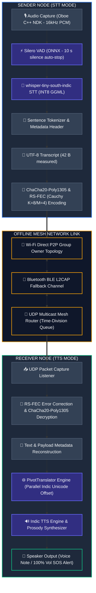

# iTantra Complete System Architecture (Mermaid Flowchart)

```mermaid
flowchart TD
    classDef senderStyle fill:#1e293b,stroke:#3b82f6,stroke-width:2px,color:#f8fafc;
    classDef meshStyle fill:#0f172a,stroke:#f59e0b,stroke-width:2px,color:#f8fafc;
    classDef receiverStyle fill:#1e293b,stroke:#10b981,stroke-width:2px,color:#f8fafc;
    classDef processStyle fill:#334155,stroke:#64748b,stroke-width:1px,color:#f8fafc;
    classDef aiStyle fill:#312e81,stroke:#6366f1,stroke-width:2px,color:#f8fafc;

    subgraph SENDER ["SENDER NODE (STT MODE)"]
        direction TD
        S1["🎙️ Audio Capture (Oboe C++ NDK - 16kHz PCM)"]:::processStyle --> S2["⚡ Silero VAD (ONNX - 10 s silence auto-stop)"]:::aiStyle
        S2 --> S3["🤖 whisper-tiny-south-indic STT (INT8 GGML)"]:::aiStyle
        S3 --> S4["📝 Sentence Tokenizer & Metadata Header"]:::processStyle
        S4 --> S5["📝 UTF-8 Transcript (42 B measured)"]:::processStyle
        S5 --> S6["🔐 ChaCha20-Poly1305 & RS-FEC (Cauchy K=8/M=4) Encoding"]:::processStyle
    end

    subgraph MESH ["OFFLINE MESH NETWORK LINK"]
        direction LR
        M1["📶 Wi-Fi Direct P2P Group Owner Topology"]:::meshStyle <--> M2["📡 Bluetooth BLE L2CAP Fallback Channel"]:::meshStyle
        M2 <--> M3["🔀 UDP Multicast Mesh Router (Time-Division Queue)"]:::meshStyle
    end

    subgraph RECEIVER ["RECEIVER NODE (TTS MODE)"]
        direction TD
        R1["📥 UDP Packet Capture Listener"]:::processStyle --> R2["🔑 RS-FEC Error Correction & ChaCha20-Poly1305 Decryption"]:::processStyle
        R2 --> R3["📄 Text & Payload Metadata Reconstruction"]:::processStyle
        R3 --> R4["🌐 PivotTranslator Engine (Parallel Indic Unicode Offset)"]:::aiStyle
        R4 --> R5["🔊 Indic TTS Engine & Prosody Synthesizer"]:::aiStyle
        R5 --> R6["📢 Speaker Output (Voice Note / 100% Vol SOS Alert)"]:::receiverStyle
    end

    S6 ==> M1
    M3 ==> R1

    class SENDER senderStyle;
    class MESH meshStyle;
    class RECEIVER receiverStyle;
```
