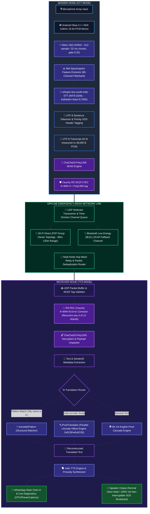

# iTantra Ultra-Detailed System Architecture (Mermaid Code)

```mermaid
flowchart TD
    %% Custom Styling Definitions
    classDef hardware fill:#0f172a,stroke:#38bdf8,stroke-width:2px,color:#f8fafc;
    classDef senderNode fill:#1e293b,stroke:#3b82f6,stroke-width:2px,color:#f8fafc;
    classDef aiEngine fill:#312e81,stroke:#818cf8,stroke-width:2px,color:#f8fafc;
    classDef secEngine fill:#4c1d95,stroke:#c084fc,stroke-width:2px,color:#f8fafc;
    classDef meshNode fill:#022c22,stroke:#34d399,stroke-width:2px,color:#f8fafc;
    classDef receiverNode fill:#1e1b4b,stroke:#a855f7,stroke-width:2px,color:#f8fafc;
    classDef outputNode fill:#14532d,stroke:#22c55e,stroke-width:2px,color:#f8fafc;

    %% -----------------------------------------------------------------
    %% SUBGRAPH 1: SENDER NODE (VOICE CAPTURE & STT PROCESSING)
    %% -----------------------------------------------------------------
    subgraph SENDER ["SENDER NODE (STT MODE)"]
        direction TD
        S_MIC["🎙️ Microphone Array Input"]:::hardware --> S_OBOE["🔊 Android Oboe C++ NDK (16kHz 16-bit PCM Mono)"]:::hardware
        S_OBOE --> S_VAD["⚡ Silero VAD (ONNX - 512-sample / 32 ms chunks, gate 0.25)"]:::aiEngine
        S_VAD --> S_MEL["📊 Mel-Spectrogram Feature Extractor (80-Channel Filterbank)"]:::aiEngine
        S_MEL --> S_STT["🤖 whisper-tiny-south-indic STT (INT8 GGML - Kathbath+Vaani 8,700h)"]:::aiEngine
        S_STT --> S_TOK["📝 UTF-8 Sentence Tokenizer & Priority SOS Header Tagging"]:::senderNode
        S_TOK --> S_COMP["📝 UTF-8 Transcript (42 B measured vs 48,000 B PCM)"]:::senderNode
        S_COMP --> S_AES["🔐 ChaCha20-Poly1305 AEAD Engine"]:::secEngine
        S_AES --> S_RS["🛡️ Cauchy RS GF(2⁸) FEC K=8/M=4 + Poly1305 tag"]:::secEngine
    end

    %% -----------------------------------------------------------------
    %% SUBGRAPH 2: MESH NETWORK & DECENTRALIZED COMMUNICATION
    %% -----------------------------------------------------------------
    subgraph MESH ["OFFLINE EMERGENCY MESH NETWORK LINK"]
        direction LR
        M_UDP["🔀 UDP Multicast Transceiver & Time-Division Channel Queue"]:::meshNode
        M_WIFI["📶 Wi-Fi Direct (P2P Group Owner Topology - 80m-120m Range)"]:::meshNode
        M_BLE["📡 Bluetooth Low Energy (BLE) L2CAP Fallback Channel"]:::meshNode
        M_ROUTER["🔂 Multi-Node Hop Mesh Relay & Packet Deduplication Router"]:::meshNode
        
        M_UDP <--> M_WIFI
        M_UDP <--> M_BLE
        M_WIFI <--> M_ROUTER
        M_BLE <--> M_ROUTER
    end

    %% -----------------------------------------------------------------
    %% SUBGRAPH 3: RECEIVER NODE (DECODING, TRANSLATION & TTS SYNTHESIS)
    %% -----------------------------------------------------------------
    subgraph RECEIVER ["RECEIVER NODE (TTS MODE)"]
        direction TD
        R_LISTEN["📥 UDP Packet Buffer & AEAD Tag Validator"]:::receiverNode
        R_LISTEN --> R_RS["🔑 RS-FEC (Cauchy K=8/M=4) Error Corrector (Recovers any 4 of 12 shards)"]:::secEngine
        R_RS --> R_AES["🔓 ChaCha20-Poly1305 Decryption & Payload Unpacker"]:::secEngine
        R_AES --> R_META["📄 Text & SenderID Metadata Extraction"]:::receiverNode
        
        R_META --> R_ROUTER{"🌐 Translation Router"}:::receiverNode
        
        R_ROUTER -- "Pattern Match ('My name is X')" --> R_PAT["⚡ translatePattern (Structural Matcher)"]:::aiEngine
        R_ROUTER -- "Indic-to-Indic Script" --> R_UNI["🔤 PivotTranslator (Parallel Unicode Offset Engine 0x0C80➔0x0C00)"]:::aiEngine
        R_ROUTER -- "General Text" --> R_MLK["🌍 ML Kit English-Pivot Cascade Engine"]:::aiEngine
        
        R_PAT --> R_MERGE["📝 Reconstructed Translated Text"]:::receiverNode
        R_UNI --> R_MERGE
        R_MLK --> R_MERGE
        
        R_MERGE --> R_TTS["🗣️ Indic TTS Engine & Prosody Synthesizer"]:::aiEngine
        R_TTS --> R_UI["📱 WhatsApp-Style Chat UI & Live Diagnostics (CPU/Power/Latency)"]:::outputNode
        R_TTS --> R_SPK["📢 Speaker Output (Normal Voice Note / 100% Vol Non-Interruptible SOS Broadcast)"]:::outputNode
    end

    %% -----------------------------------------------------------------
    %% INTER-SUBGRAPH CONNECTIONS
    %% -----------------------------------------------------------------
    S_RS ==> M_UDP
    M_ROUTER ==> R_LISTEN

    class SENDER senderNode;
    class MESH meshNode;
    class RECEIVER receiverNode;
```
