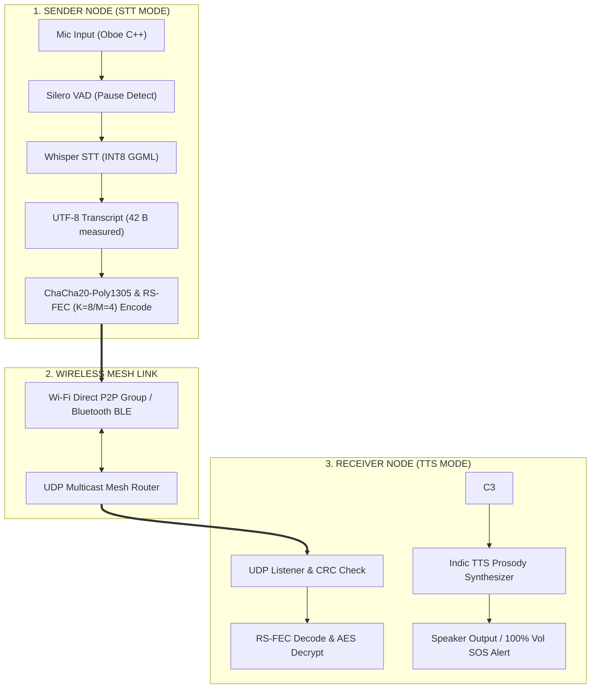

# iTantra — Napkin AI Ready-to-Paste Visual Blueprint

---

## 🎨 OPTION 1: TEXT FORMAT FOR NAPKIN AI INFOGRAPHICS & DIAGRAMS
*(Copy and paste any section below into Napkin AI to generate instant visual diagrams)*

---

### 1️⃣ NAPKIN AI PROCESS FLOW DIAGRAM (Step-by-Step Pipeline)

**Title: iTantra Offline Voice Communication Pipeline**

* **Step 1: Voice Capture**
  * Microphones record audio at 16kHz PCM via Android Oboe C++ NDK
* **Step 2: Pause Detection**
  * Silero VAD gates speech (512-sample / 32 ms chunks, gate 0.25) and recording auto-stops after 10 s of silence; pause-triggered STT is Target, not yet built
* **Step 3: Edge-AI STT**
  * `whisper-tiny-south-indic` transcribes voice to text in <250ms
* **Step 4: Semantic Compression**
  * Audio stream (32 kB/s) compressed into a 64-Byte binary packet (100x reduction)
* **Step 5: Security & Encoding**
  * ChaCha20-Poly1305 AEAD applied + Cauchy Reed-Solomon GF(2⁸) K=8/M=4 Error Correction
* **Step 6: Wireless Mesh Broadcast**
  * UDP multicast broadcast over Wi-Fi Direct (80-120m) & Bluetooth BLE
* **Step 7: Replay & Speech Synthesis**
  * Receiver decrypts text, transliterates name scripts, and plays voice note via Indic TTS

---

### 2️⃣ NAPKIN AI COMPARISON GRID (Problem vs Solution)

**Title: Traditional Voice Radio vs iTantra Edge-AI Mesh**

* **TRADITIONAL AUDIO STREAMING (FAILED)**
  * **Heavy Data Rate**: 128-256 kbps continuous audio stream
  * **Cellular Dependency**: Requires active cell towers and internet
  * **High Packet Loss**: Network congestion causes dropped voice calls
  * **Channel Collision**: Multiple radios overlap and block channels

* **iTANTRA SEMANTIC MESH (SUCCESS)**
  * **Text Not Audio**: 42 B UTF-8 transcript measured vs 48,000 B PCM (~1,100x less data at payload; ~7x on the wire incl. RS-FEC)
  * **100% Offline Mesh**: Direct phone-to-phone Wi-Fi Direct / Bluetooth link
  * **Error Resilient**: Reed-Solomon FEC recovers up to 16 lost bytes per packet
  * **Multi-Node Collision Avoidance**: Unique SenderID headers and time-division queue

---

### 3️⃣ NAPKIN AI ARCHITECTURE CARDS (Sender ➔ Link ➔ Receiver)

**Title: iTantra System Architecture**

* **SENDER NODE (STT MODE)**
  * Mic Audio Capture (16kHz PCM via Oboe C++)
  * Pause Detection (Silero VAD ONNX INT8)
  * Offline Speech-to-Text (`whisper-tiny-south-indic` 43.5MB)
  * Transcript (42 B measured) instead of 48,000 B of PCM
  * ChaCha20-Poly1305 AEAD & Cauchy RS K=8/M=4 FEC Encoding

* **OFFLINE MESH NETWORK LINK**
  * Wi-Fi Direct P2P Group Owner Topology (80m-120m Range)
  * Bluetooth BLE Fallback Link
  * UDP Multicast Datagram Sockets
  * Multi-Hop Relay Router & Packet Deduplication

* **RECEIVER NODE (TTS MODE)**
  * UDP Packet Listener & CRC Checksum Validation
  * Cauchy RS K=8/M=4 Error Correction & ChaCha20-Poly1305 Decryption
  * Indic Unicode Script Transliteration (`PivotTranslator`)
  * Indic TTS Speech Synthesizer & Prosody Engine
  * WhatsApp-Style Chat UI & Speaker Output (100% Volume SOS Alert)

---

### 4️⃣ NAPKIN AI TECH STACK VISUAL CARDS

**Title: iTantra Technology Stack**

* **Mobile & UI Layer**
  * Android SDK, Kotlin, Coroutines, Material Design 3, Room Database
* **Native C++ Audio Layer**
  * C++20, Android NDK, JNI Bridge, Oboe Low-Latency Audio API
* **Edge-AI Engine**
  * Silero VAD (ONNX INT8), `whisper-tiny-south-indic` (GGML INT8), IndicConformer
* **Translation & Transliteration**
  * ML Kit Translate, `PivotTranslator` (10-Language Parallel Indic Unicode Engine)
* **Wireless Mesh Networking**
  * Wi-Fi Direct (P2P), Bluetooth BLE, UDP Multicast Sockets
* **Security & Reliability**
  * ChaCha20-Poly1305 AEAD (AES-256-GCM fallback), Cauchy RS K=8/M=4 FEC, Poly1305 tag

---

## 🧜‍♂️ OPTION 2: MERMAID CODE FOR NAPKIN AI
*(If using Napkin AI's Mermaid diagram feature, paste the code below)*

