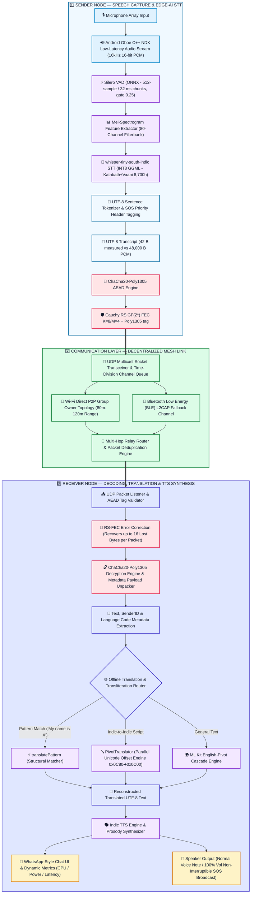

# iTantra Detailed System Architecture (Pastel Light & Bright Vertical Flowchart)

```mermaid
flowchart TD
    %% -----------------------------------------------------------------
    %% PASTEL, LIGHT & BRIGHT THEME STYLING
    %% -----------------------------------------------------------------
    classDef hardwareStyle fill:#e0f2fe,stroke:#0284c7,stroke-width:2px,color:#0f172a;
    classDef senderStyle fill:#f0f9ff,stroke:#0369a1,stroke-width:2px,color:#0f172a;
    classDef aiStyle fill:#f3e8ff,stroke:#7e22ce,stroke-width:2px,color:#0f172a;
    classDef secStyle fill:#ffe4e6,stroke:#e11d48,stroke-width:2px,color:#0f172a;
    classDef meshStyle fill:#dcfce7,stroke:#15803d,stroke-width:2px,color:#0f172a;
    classDef receiverStyle fill:#e0e7ff,stroke:#4338ca,stroke-width:2px,color:#0f172a;
    classDef outputStyle fill:#fef3c7,stroke:#d97706,stroke-width:2px,color:#0f172a;

    %% -----------------------------------------------------------------
    %% STAGE 1: SENDER NODE (VERTICAL TOP-TO-BOTTOM FLOW)
    %% -----------------------------------------------------------------
    subgraph STAGE1 ["1️⃣ SENDER NODE — SPEECH CAPTURE & EDGE-AI STT"]
        direction TD
        S_MIC["🎙️ Microphone Array Input"]:::hardwareStyle --> S_OBOE["🔊 Android Oboe C++ NDK Low-Latency Audio Stream (16kHz 16-bit PCM)"]:::hardwareStyle
        S_OBOE --> S_VAD["⚡ Silero VAD (ONNX - 512-sample / 32 ms chunks, gate 0.25)"]:::aiStyle
        S_VAD --> S_MEL["📊 Mel-Spectrogram Feature Extractor (80-Channel Filterbank)"]:::aiStyle
        S_MEL --> S_STT["🤖 whisper-tiny-south-indic STT (INT8 GGML - Kathbath+Vaani 8,700h)"]:::aiStyle
        S_STT --> S_TOK["📝 UTF-8 Sentence Tokenizer & SOS Priority Header Tagging"]:::senderStyle
        S_TOK --> S_COMP["📝 UTF-8 Transcript (42 B measured vs 48,000 B PCM)"]:::senderStyle
        S_COMP --> S_AES["🔐 ChaCha20-Poly1305 AEAD Engine"]:::secStyle
        S_AES --> S_RS["🛡️ Cauchy RS GF(2⁸) FEC K=8/M=4 + Poly1305 tag"]:::secStyle
    end

    %% -----------------------------------------------------------------
    %% STAGE 2: OFFLINE MESH NETWORK LINK (VERTICAL MIDDLE LAYER)
    %% -----------------------------------------------------------------
    subgraph STAGE2 ["2️⃣ COMMUNICATION LAYER — DECENTRALIZED MESH LINK"]
        direction TD
        M_UDP["🔀 UDP Multicast Socket Transceiver & Time-Division Channel Queue"]:::meshStyle
        M_WIFI["📶 Wi-Fi Direct P2P Group Owner Topology (80m-120m Range)"]:::meshStyle
        M_BLE["📡 Bluetooth Low Energy (BLE) L2CAP Fallback Channel"]:::meshStyle
        M_ROUTER["🔂 Multi-Hop Relay Router & Packet Deduplication Engine"]:::meshStyle
        
        M_UDP --> M_WIFI
        M_UDP --> M_BLE
        M_WIFI --> M_ROUTER
        M_BLE --> M_ROUTER
    end

    %% -----------------------------------------------------------------
    %% STAGE 3: RECEIVER NODE (VERTICAL BOTTOM LAYER)
    %% -----------------------------------------------------------------
    subgraph STAGE3 ["3️⃣ RECEIVER NODE — DECODING, TRANSLATION & TTS SYNTHESIS"]
        direction TD
        R_LISTEN["📥 UDP Packet Listener & AEAD Tag Validator"]:::receiverStyle
        R_LISTEN --> R_RS["🔑 RS-FEC Error Correction (Recovers up to 16 Lost Bytes per Packet)"]:::secStyle
        R_RS --> R_AES["🔓 ChaCha20-Poly1305 Decryption Engine & Metadata Payload Unpacker"]:::secStyle
        R_AES --> R_META["📄 Text, SenderID & Language Code Metadata Extraction"]:::receiverStyle
        
        R_META --> R_ROUTER{"🌐 Offline Translation & Transliteration Router"}:::receiverStyle
        
        R_ROUTER -- "Pattern Match ('My name is X')" --> R_PAT["⚡ translatePattern (Structural Matcher)"]:::aiStyle
        R_ROUTER -- "Indic-to-Indic Script" --> R_UNI["🔤 PivotTranslator (Parallel Unicode Offset Engine 0x0C80➔0x0C00)"]:::aiStyle
        R_ROUTER -- "General Text" --> R_MLK["🌍 ML Kit English-Pivot Cascade Engine"]:::aiStyle
        
        R_PAT --> R_MERGE["📝 Reconstructed Translated UTF-8 Text"]:::receiverStyle
        R_UNI --> R_MERGE
        R_MLK --> R_MERGE
        
        R_MERGE --> R_TTS["🗣️ Indic TTS Engine & Prosody Synthesizer"]:::aiStyle
        R_TTS --> R_UI["📱 WhatsApp-Style Chat UI & Dynamic Metrics (CPU / Power / Latency)"]:::outputStyle
        R_TTS --> R_SPK["📢 Speaker Output (Normal Voice Note / 100% Vol Non-Interruptible SOS Broadcast)"]:::outputStyle
    end

    %% -----------------------------------------------------------------
    %% VERTICAL STAGE CONNECTIONS
    %% -----------------------------------------------------------------
    S_RS ==> M_UDP
    M_ROUTER ==> R_LISTEN

    class STAGE1 senderStyle;
    class STAGE2 meshStyle;
    class STAGE3 receiverStyle;
```
