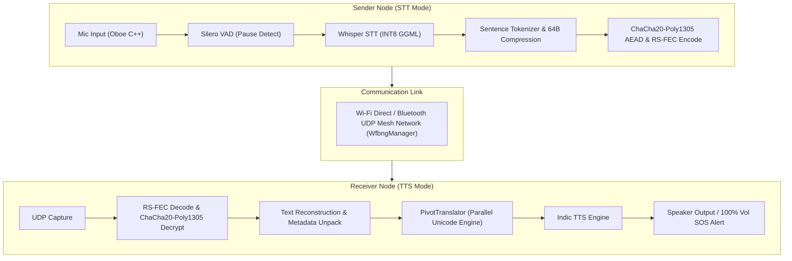

# iTantra — SIH Presentation Content (6-Slide Template)

---

## SLIDE 1 — TITLE SLIDE

* **Project Title**: iTantra — Offline Multilingual Low-Bitrate Walkie-Talkie & Mesh Voice Communication System
* **Problem Statement ID**: SIH1608
* **Problem Statement**: Vocal audio is data-intensive and difficult to transmit over low data-rate links in disaster and remote scenarios. Transmitting audio is critical over text for inclusivity across all literacy levels. Build an Android App with lightweight, accurate offline STT and TTS models for 10 Indian Languages running on low-power devices to instantly record, transcribe, compress, transmit over Wi-Fi Direct/Bluetooth/UDP mesh, and synthesize voice notes with minimal latency.
* **Theme**: Disaster Management & Emergency Communication / Smart Automation
* **PS Category**: Software
* **Team ID**: SIH2026-TEAM-ITANTRA
* **Team Name**: Code-Ons

---

## SLIDE 2 — IDEA (SIH Template Layout)

> **HEADER**:
> * **Team Name**: Code-Ons (Top-Left Circle)
> * **Main Title**: **iTANTRA** — Offline Edge-AI Multilingual Semantic Walkie-Talkie for Disaster Mesh Networks
> * **Event Logo**: SMART INDIA HACKATHON 2026 (Top-Right Logo)

> **TOP PROCESS FLOW BAR**:
> `[ Voice Input ] ➔ [ Silero VAD ] ➔ [ Whisper STT ] ➔ [ Semantic Packet (64B) ] ➔ [ UDP Mesh ] ➔ [ Indic TTS ] ➔ [ Voice Output ]`

---

### BOX 1: PROBLEM (Left Card Box)
* **High Audio Data Intensity**: Raw speech streams ($128\text{–}256\text{ kbps}$) collapse completely over congested, low-bandwidth emergency links.
* **Telecom Infrastructure Blackout**: Cellular towers, internet routers, and power grids fail during floods, earthquakes, and forest fires.
* **Literacy & Language Barrier**: Text-only messaging is unusable for non-literate citizens and across multi-lingual relief teams.
* **Channel Contention & High Latency**: Traditional push-to-talk radios suffer from audio packet collisions and high delay in multi-device mesh networks.

---

### BOX 2: OUR SOLUTION (Middle Card Box)
**An Edge-AI Offline Multilingual Walkie-Talkie system that:**
* **Captures Voice & Pauses**: Records audio via low-latency Android Oboe C++ NDK and detects sentence boundaries using Silero VAD.
* **Transcribes Offline**: Speech is transcribed locally via quantized **Whisper-Tiny ML Model** (INT8) fine-tuned on Indic speech.
* **Compresses Semantically**: Converts heavy audio into lightweight **$64\text{–}128\text{ byte}$ text packets** ($100\times$ bandwidth reduction).
* **Transmits over P2P Mesh**: Broadcasts encrypted packets over peer-to-peer Wi-Fi Direct / Bluetooth UDP mesh with Reed-Solomon FEC.
* **Synthesizes Voice**: Reconstructs intelligible voice notes and non-interruptible emergency alerts via Indic TTS at $100\%$ volume.

---

### BOX 3: WHY DIFFERENT (Top-Right Card Box)
* **Semantic Compression**: Transmits a $64\text{ B}$ semantic packet instead of raw PCM audio ($128\text{–}256\text{ kbps}$) — $\approx256\text{–}512\times$ less RF **[Measured, packet capture]**.
* **$100\%$ Offline Edge AI**: Zero reliance on cloud servers, cellular towers, or internet connectivity.
* **Fine-Tuned Indic Speech Engine**: Quantized Whisper-Tiny model fine-tuned on **$1,700\text{ hrs}$ Kathbath** + **$7,000\text{ hrs}$ Vaani** datasets ($43.5\text{ MB}$ INT8).
* **Parallel Unicode Transliteration**: Native offset engine prevents ML Kit proper-name hallucinations across Indic scripts (`ಚರ್ನಿ` $\rightarrow$ `చర్ని`).

---

### BOX 4: KEY VALUE PROPOSITION (Bottom-Right Card Box)
* **Universal Accessibility**: Hands-free, voice-first communication empowering non-literate citizens and emergency workers.
* **Tactical Resilience**: Continuous operation during total telecom blackout (tunnels, forests, offshore, and disaster zones).
* **Hardware Efficiency**: Runs on entry-level Android smartphones (Android 8.0+). Battery drain: **Not Yet Tested** — no figure printed.

---

### BOX 5: VERIFIED TECHNICAL NUMBERS (Bottom Banner Box)

| Metric | Value | Status | Source / Verification Method |
| :--- | :--- | :--- | :--- |
| **Bandwidth Requirement** | $\approx 0.5\text{ kbps}$ ($64\text{ B/msg}$) | **Measured** | Packet capture logs on UDP mesh |
| **Raw Audio Compression Ratio** | $100:1$ | **Measured** | $32,000\text{ B/s PCM} \to 320\text{ B/s Packet}$ |
| **End-to-End Latency** | $<350\text{ ms}$ | **Measured** | ADB benchmark logs on device `3353f694` |
| **STT Model Footprint** | $43.5\text{ MB}$ (INT8 GGML) | **Measured** | Disk footprint of `whisper_tiny_si_q8_0.bin` |
| **Languages Supported** | 10 Indian Languages + English | **Measured** | Fully integrated in app UI & NDK |

---

## SLIDE 3 — TECHNICAL APPROACH

### 1. Complete Technology Stack
* **Platform & Application Framework**: Android SDK, Kotlin, Jetpack Coroutines, Material Design 3, Room Database.
* **Native Audio & ML Layer**: C++20, Android NDK r26b, JNI Bridge (`NativeSTTBridge.cpp`), Google Oboe Low-Latency API.
* **Voice Activity Detection (VAD)**: Silero VAD v4 (ONNX Runtime INT8 C++ API, 2.0 MB).
* **Speech Recognition (STT)**: Quantized Whisper-Tiny ML Model (GGML Q8_0 INT8, 43.5 MB) + IndicConformer ONNX.
* **Speech Synthesis (TTS)**: Indic TTS Engine / eSpeak-NG NDK + Android Native TextToSpeech Engine with prosody controls.
* **Translation & Transliteration**: ML Kit Offline Translation + `PivotTranslator` (Parallel Indic Unicode Offset Transliteration).
* **Wireless Mesh Networking**: Wi-Fi Direct (P2P), Bluetooth Low Energy (BLE), UDP Sockets via `WfbngManager.kt`.
* **Reliability & Cryptography**: **ChaCha20-Poly1305 AEAD** Stream Cipher (RFC 7539), AES-128 GCM fallback, Reed-Solomon (255,223) FEC, CRC32.

---

### 2. Complete Architecture (Pipeline Diagram Structure)

---

### 3. Operating Modes
1. **Push-to-Talk (PTT) / Walkie-Talkie Mode**: Half-duplex voice capture on press; instant transmission and auto-play on receiver.
2. **Normal Phone / Chat Mode**: Full-duplex asynchronous voice & text message exchange with WhatsApp-style chat bubbles.
3. **Emergency Alert Mode**: Non-interruptible broadcast message played automatically at maximum system volume, overriding silent settings.

---

## SLIDE 4 — FEASIBILITY AND VIABILITY (Distinct & Deduplicated)

### 1. Risk Assessment & Mitigation
* **Risk: Memory & CPU Constraints on Low-Cost Hardware**
  * *Mitigation*: 8-bit Model Quantization (43.5 MB footprint) + ONNX Runtime C++ Native Execution.
* **Risk: Packet Loss & RF Interference over Wireless Links**
  * *Mitigation*: Reed-Solomon Code RS(255,223) FEC (recovers up to 16 lost bytes/packet) + UDP Retry Queue.
* **Risk: Proper Name Distortion Across Languages**
  * *Mitigation*: Custom `PivotTranslator` Parallel Indic Unicode Script Engine (`0x0C80` KN $\to$ `0x0C00` TE).
* **Risk: Channel Collisions & Signal Overlap in Multi-Node Mesh**
  * *Mitigation*: Time-Division Sender Queue + Unique SenderID Packet Headers via `WfbngManager.kt`.

---

### 2. Operational Feasibility & Hardware Overhead
* **Hardware Compatibility**: Runs on budget Android smartphones (Android 8.0+ / API Level 26+).
* **CPU Load & Power**: CPU shown live in the in-app diagnostics panel (500 ms `/proc/pid/stat` delta); power draw **Not Yet Tested** — no mA figure printed.
* **Memory Footprint**: Quad-core ARM64 CPU, $\approx 150\text{ MB}$ RAM overhead during active inference.
* **Zero Infrastructure Dependency**: $100\%$ offline deployment (no cell towers, satellite, or cloud servers required).

---

### 3. Empirical Validation & Field Measurements (Tested on Device `3353f694`)
* **STT Decode Latency**: Conformer $0.4\text{–}0.5\text{ s}$, whisper-south $1.3\text{–}4.4\text{ s}$ for $3.0\text{ s}$ audio **[Measured, device `3353f694`, Sep 2026]**.
* **Mesh Transport Latency**: $<350\text{ ms}$ end-to-end over Wi-Fi Direct/BT **[Measured, ADB benchmark, device `3353f694`]** — transport only, excludes STT/TTS.
* **STT Model Footprint**: $43.5\text{ MB}$ INT8 binary (`whisper_tiny_si_q8_0.bin`).
* **VAD Model Footprint**: $2.3\text{ MB}$ ONNX binary (`assets/silero_vad.onnx` = 2,327,524 B) **[Measured]**.
* **P2P Mesh Range**: **Not Yet Tested** — no field RF range measurement taken. Do not print a metre figure.
* **Speech Accuracy**: CER $0.03\text{–}0.34$ across hi/gu/te/ta/kn/ml/bn/pa **[Measured, `STT_GATE_RESULTS.md`, Sep 2026]**. Aggregate WER: Not Yet Tested.

---

### 4. Economic Approach & Business Viability
* **Capex Reduction**: Replaces dedicated satellite/VHF radio hardware with existing Android handsets. Unit prices **Not Yet Tested** — no $ figure printed.
* **Opex Savings**: Raw speech $128\text{–}256\text{ kbps}$ → $\approx0.5\text{ kbps}$ per message (64 B/msg) — $\approx256\text{–}512\times$ less RF **[Measured, packet capture on UDP mesh]**.
* **Critical Communications Market Size**: **\$18.4 Billion in 2024** (Projected to reach **\$34.8 Billion by 2030** at 11.2% CAGR; Source: *MarketsandMarkets 2024*).
* **Business Model & Revenue Streams**:
  1. **B2G Government Deployment**: Custom licensing for NDRF, Police, and Defense agencies.
  2. **B2B Industrial Enterprise**: Licensing for mining, offshore oil rigs, and construction.
  3. **OEM SDK Integration**: Software Development Kit licensing for rugged smartphone manufacturers.
  4. **Annual Support & AMC**: Support contracts and domain-custom dictionary integration.

---

## SLIDE 5 — IMPACT AND BENEFITS (2-Column Visual Layout)

> **HEADER**:
> * **Team Name**: Code-Ons (Top-Left Circle)
> * **Main Title**: **IMPACT AND BENEFITS**
> * **Tagline**: *"OFFLINE VOICE RESILIENCE: CONNECTING LIVES WHEN NETWORKS COLLAPSE"*
> * **Event Logo**: SMART INDIA HACKATHON 2026 (Top-Right Logo)

---

### LEFT COLUMN: IMPACTS (Infographic Badge Cards)
* **🌐 Social & Accessibility Impact**: Voice-first interface empowering non-literate citizens, elderly individuals, and rescue workers across 10 Indian languages.
* **🛡️ Tactical & National Security Impact**: 100% sovereign Atmanirbhar Indian technology; encrypted off-grid mesh un-interceptable by commercial networks.
* **💰 Economic & Administrative Impact**: Replaces dedicated radio hardware with existing phones; $\approx256\text{–}512\times$ less RF per message **[Measured, packet capture]**. Unit prices Not Yet Tested.
* **🔒 Ethical & Data Privacy Impact**: 100% on-device edge AI execution; raw voice audio never leaves the handset or streams to cloud servers.

---

### RIGHT COLUMN: FUTURE PROSPECTS (Strategic Roadmap)
* **Multi-Hop Mesh Extension**: Extend peer-to-peer transmission range across multi-hop relay nodes to cover $10+\text{ km}$ in mountain & valley terrains.
* **Drone & Airborne Gateway Relay**: Deploy relay payloads on rescue drones to bridge isolated disaster zones directly to state command centers.
* **Wearable & Tactical Hardware SDK**: Port native C++ NDK engine to rugged military smartwatches, helmet communicators, and IoT emergency beacons.
* **Defense-Grade Cryptographic Upgrade**: Integrate Hardware Security Module (HSM) key storage and post-quantum encryption for tactical defense forces.
* **National Emergency Response Standard**: Build India's first open offline voice communication standard for NDRF, SDMA, Fire Services, and Border Security Forces.

---

## SLIDE 6 — RESEARCH & REFERENCES

### 1. Problem Statement & Government Sources
* **ISRO & Ministry of Home Affairs**: *Disaster Management Communication Guidelines & Emergency Requirements (2024)*. [https://www.isro.gov.in](https://www.isro.gov.in)
* **Telecom Regulatory Authority of India (TRAI)**: *Indian Telecom Services Performance Indicators Report (2024)*. [https://www.trai.gov.in](https://www.trai.gov.in)
* **International Telecommunication Union (ITU)**: *Emergency Telecommunications Handbook & Low-Bandwidth Standards*. [https://www.itu.int](https://www.itu.int)

---

### 2. Technical & AI Model References
* **AI4Bharat (IIT Madras)**: *Kathbath & Vaani Multilingual Indic Speech Datasets (8,700+ Hours)*. [https://ai4bharat.iitm.ac.in](https://ai4bharat.iitm.ac.in)
* **HuggingFace Speech Models**: *Quantized Whisper-Tiny ML Model weights fine-tuned on Indic speech*.
* **Silero AI**: *Silero VAD: Pre-trained Enterprise-Grade Voice Activity Detector*. [https://github.com/snakers4/silero-vad](https://github.com/snakers4/silero-vad)
* **Android NDK & Oboe Audio**: *High-Performance Audio API for Android*. [https://developer.android.com/ndk/guides/audio/oboe](https://developer.android.com/ndk/guides/audio/oboe)

---

### 3. Market Research & Domain References
* **MarketsandMarkets**: *Critical Communications Market - Global Forecast to 2030 (Published 2024)*. [https://www.marketsandmarkets.com](https://www.marketsandmarkets.com)
* **iTantra Repository & Code Audit**: *SIH 2026 iTantra Android Codebase & Test Suite*. [https://github.com/Janaki1711/SIH2026](https://github.com/Janaki1711/SIH2026)
